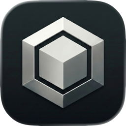

<p align="center">
  
</p>

<h1 align="center">Tesseract</h1>

<p align="center"><b>A personal AI assistant that runs entirely on your Mac.</b><br>
No cloud. No accounts. No telemetry.</p>

<p align="center">
  <a href="https://github.com/spokvulcan/tesseract/releases/latest"></a>
  
  
  
</p>

<p align="center">
  <a href="https://github.com/spokvulcan/tesseract/releases/latest/download/Tesseract.dmg"><b>⬇&nbsp; Download for Mac</b></a>
  &nbsp;·&nbsp;
  <a href="https://thetesseract.app">Website</a>
  &nbsp;·&nbsp;
  <a href="CHANGELOG.md">Changelog</a>
</p>

---

Frontier AI on hardware you already own. Every model runs locally on Apple Silicon via [MLX](https://github.com/ml-explore/mlx) — an assistant you can trust with your whole life precisely because your data never leaves your Mac.

| | |
|:---:|---|
| 🧠 | **Agent** — a tool-calling assistant that remembers you across conversations. Voice or text, images and screenshots, reminders, goals, habits. |
| ⚡ | **Inference server** — OpenAI-compatible `/v1/chat/completions` with tiered RAM + SSD prefix caching. Plug any coding-agent harness into a fully local backend. |
| 🎙️ | **Dictation** — hold a hotkey, speak, release. Whisper types your words into any app, fully offline. |
| 🗣️ | **Text-to-speech** — natural long-form voice synthesis, state-of-the-art quality on device. |

## Getting started

[Download the DMG](https://github.com/spokvulcan/tesseract/releases/latest/download/Tesseract.dmg) (signed & notarized), drag it to Applications, and follow onboarding. Works without internet after the one-time model download. Requires macOS 26+ on Apple Silicon.

## Development

```bash
scripts/dev.sh dev-release   # Build & launch — run with no args for all commands
```

See [ARCHITECTURE.md](ARCHITECTURE.md) for design, [CONTEXT.md](CONTEXT.md) for domain vocabulary, and [CLAUDE.md](CLAUDE.md) for working conventions.
