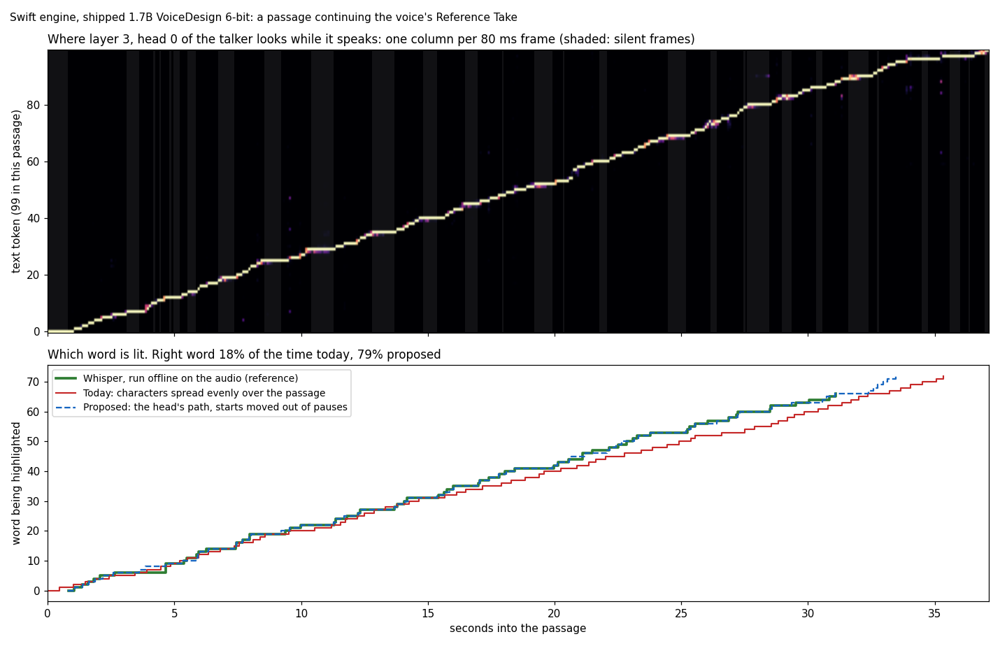
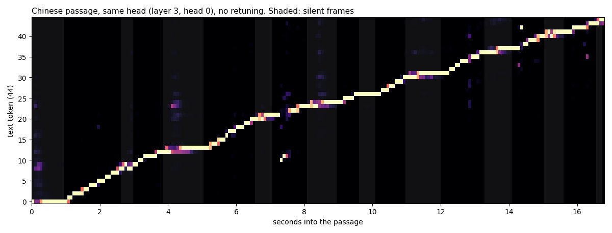

# Word timing from the voice model's own attention, and a continuous Speech Overlay

**Date:** 2026-09-27

**Questions**
1. Why does the Read-Along's highlight drift off the word being heard, even inside one paragraph?
2. Can every word be timed accurately, pauses, numbers and speed changes included, without running a speech recognizer next to the voice, and at what cost?
3. How should the Speech Overlay show a continuous feed of text that scrolls and is never swapped out?

**Method.** Measured, not argued. Qwen3-TTS rendered 30 read-aloud passages on the shipped checkpoint (`mlx-community/Qwen3-TTS-12Hz-1.7B-VoiceDesign-6bit`) in three voices, with prompts laid out as the engine lays them out. Every attention head's weights over the passage's text were recorded at every frame; each way of timing words was scored against Whisper's word timestamps for the same audio. More renders checked the 8-bit checkpoint, the 0.6B CustomVoice checkpoint and three more languages, and the Swift engine itself (a probe in a scratch worktree) checked cost and accuracy. Section 3 has the setup. Code: `research/word-timing-2026-09-27/` (`capture.py`, `capture2.py`, `analyze.py`, `swift-probe.patch`; not in git). Prior work and design sources are cited where used.

## In short

- **Today's highlight is wrong most of the time.** The Read-Along spreads a passage's characters evenly over its audio (ADR-0076). Its word starts are off by a median of half a second: 21% land within 200 ms of when the word is heard, and the lit word is the heard word 29% of the time. Speech isn't even. Passages after the first open with about half a second of silence, silence is 30% of their audio, the pace runs from 7 to 16 characters a second, and "2026" takes longer to say than "the".
- **The voice model already knows which word it is saying.** One attention head of the talker, layer 3 head 0 in the shipped model, looks at the text token being spoken, frame by frame. It sits on a word while the word is spoken, stays on the punctuation through a pause, and steps on as the next word starts (figure 1). Argmax reported such heads in every Qwen3-TTS variant this month and uses them to catch skipped words ([Taming Long-form Text-to-Speech](https://arxiv.org/abs/2609.16989)). It names no heads and measures no word timing; this study does both.
- **The recipe:**
  1. Read that one head over the passage's text at each 80 ms frame.
  2. Follow it with a path that only moves forward.
  3. Move a word's start out of any pause the audio shows: the model moves to the next word when a pause begins, and the voice says it when the pause ends.

  On voices not used for tuning, word starts land a median 40 ms from Whisper's. 96% are within 200 ms and 98% within 300 ms, against 21% and 32% today.
- **It holds beyond the shipped model:**
  - the 8-bit checkpoint, with the same head;
  - the 0.6B CustomVoice checkpoint, with its own head (layer 6 head 5);
  - Russian and German, with the same head;
  - Chinese, by eye only: Whisper can't time Chinese characters.
- **It costs nothing measurable.** In the Swift engine, a frame took a median 11.00 ms with the probe and 11.00 ms without, and produced identical audio. There is no second model. A recognizer would add a 0.8–0.9B-parameter model; Whisper large-v3-turbo, measured here, took 10.9 s and 1.6 GB of memory for 2 minutes of speech.
- **The overlay should be a roll-up feed.** Today it shows two lines, swaps them for the next two, and swaps all its text when the next passage starts. Instead: one continuous column of lines built as passages arrive (up to 8 s ahead), each line measured once and kept. The column scrolls up smoothly as reading moves to the next line, and only the lines on screen plus a margin are drawn (section 6).
- **Implemented** as ADR-0077. Through the production engine end to end (206 words, four segments, the shipped checkpoint with the Neural Engine codec), word starts land a median 40 ms from Whisper's and 97% within 200 ms, against 30% for the even spread.

## 1. Why today's highlight drifts

The Read-Along places each passage on the audio timeline exactly: it switches passages when the playback head reaches the passage's first frame. Inside a passage it guesses. Words advance in proportion to their characters over the passage's audio, at a learned pace until the passage's end is known (ADR-0076, decision 2). Speech doesn't spread that way.

| On the 30 passages, shipped checkpoint | First passage (plain) | Later passages (continuing the take) |
|---|---|---|
| Silence before the first word, median (longest) | 0.03 s (0.27 s) | 0.53 s (1.55 s) |
| Share of the audio that is silence | 19% | 30% |

- **Pace varies:** 7.0 to 16.3 characters a second between passages.
- **Cost in the audio doesn't follow characters:** "2026," is five characters and about a second of audio ("twenty twenty-six"); "M3", "27B", "10%" and web addresses run long too.
- **The error is there from the start:** a median 440 ms in the first third of a passage and 595 ms in the middle third. That is the "quickly off, even in the same paragraph" the owner sees.
- **Not a factor on this Mac: output latency.** The playback head is the player's render position. The built-in speakers add 14 ms before it is heard (1.5 ms device latency, 1.5 ms safety offset, 10.7 ms I/O buffer, read from Core Audio). Bluetooth headphones add much more; section 4 compensates.

## 2. The model already knows where it is

The talker predicts each 80 ms frame from everything before it, including the passage's text tokens. Across 28 layers × 16 heads, one head stands out: **layer 3, head 0** puts nearly all of its attention on one text token, and that token walks through the text in step with the voice. Figure 1's top panel shows it on a passage the Swift engine rendered. The lower panel shows which word each method lights, against Whisper's timing.

- The step comes when the new word starts, so the head gives word starts to within a frame. During a pause the head holds on the punctuation, then often moves to the next word while the silence is still going.
- Other heads know less:
  - layer 17 heads 8 and 9 track loosely, on the heard word 39% and 36% of the time against 66% for layer 3 head 0;
  - layer 3 heads 1 and 13 track sharply but a token off;
  - averaging the best heads with the first never beat the first alone.
- **The audio is on an exact grid.** The codec decoder is causal with no lookahead, so frame *k* is exactly the audio from 80·*k* to 80·*k* + 80 ms ([Qwen3-TTS report §3.4](https://arxiv.org/html/2601.15621v1); the decoder's code: causal convolutions and a 72-frame causal window). A frame's attention therefore dates a word to the frame.
- **The one systematic miss is pauses.** The model moves its attention to the next word as a pause begins; the voice says the word as the pause ends. Of the words the path alone put more than 300 ms off, 94% were a passage's first word or a word right after a comma or a full stop, off by about the pause's length (250–900 ms). The audio settles it: the synthesizer already measures each frame's loudness for the silence cap. A start that falls inside a pause, or within four frames before one, moves to where the sound resumes.

## 3. Measurements

**Setup**
- **Model:** the shipped checkpoint in [mlx-audio](https://github.com/Blaizzy/mlx-audio) 0.5.4's Python port, with the engine's prompt layouts and sampling:
  - talker temperature 0.9, top-k 50, top-p 1.0, repetition penalty 1.05; code predictor temperature 0.5;
  - the first passage in Qwen's streaming-text layout, and every later passage continuing its take in the in-context layout (ADR-0072).
- **Swift check:** seven passages through the Swift engine with a probe in the same head gave the same accuracy (below).
- **Voices:** an older British woman, a low middle-aged man, a bright young American woman.
- **Passages (10 per voice, all original text):**
  - three narrative;
  - a technical post with a version number, percentages and a web address;
  - one dense with numbers (dates, decimals, units);
  - dialogue with quotes and a dash;
  - a recipe with a list;
  - one of very long words.

  Two passages were rendered in both layouts. In all: 30 passages, 1,440 words, 11.5 minutes of audio.
- **More renders:** the 8-bit checkpoint (12 passages), the 0.6B CustomVoice checkpoint with speakers Ryan and Aiden (12, streaming-text layout), and Russian, German and Chinese on the shipped checkpoint (10).
- **Reference:** Whisper large-v3-turbo's word timestamps (WhisperKit 1.0.0 with the app's own dictation model files), run offline on the rendered audio.
  - Words were matched to the text by spelling; 95% of English words matched.
  - Whisper often opens a word at the start of the pause before it, inside silence. The corrected reference moves those starts (189 of 1,375) to where the sound resumes.
  - Tables use the corrected reference. Against raw Whisper every method scores a few points lower and every conclusion stands (appendix).
- **Held out:** the head and a constant offset (+20 ms) were chosen on voice 1 alone; the tables report voices 2 and 3.

**Metrics**
- *Start error*: how far a method's start for a word is from the reference's, in ms. A typical word here lasts 300 ms (Whisper's median).
- *Within 200 ms*: the share of words whose start error is 200 ms or less.
- *Heard-word share*: of the time from the first word to the last, the share during which the method lights the word the reference places there. Whisper's own boundaries are uncertain by tens of milliseconds, so no method reaches 100% against it.

**Results, voices 2 and 3 (921 words; tuning used voice 1 only)**

| Method | Median start error | 90% of words within | Within 200 ms | Heard-word share |
|---|---|---|---|---|
| Today: characters spread evenly over the passage | 504 ms | 1,409 ms | 21% | 29% |
| Audio only: pauses pinned to punctuation, syllables between | 140 ms | 404 ms | 62% | 58% |
| Attention path alone | 60 ms | 510 ms | 81% | 65% |
| **Attention path, starts moved out of pauses** | **40 ms** | **120 ms** | **96%** | **82%** |

- **What the attention rows ran:** the recipe the app would run.
  - one head;
  - the path decided 8 frames (640 ms) behind generation, as frames arrive;
  - silence judged per 80 ms frame: 25 dB under the recent peak, for at least two frames.

  Deciding over the whole passage at once, or finding pauses at 10 ms resolution, scores within 1–3 points of it.
- **Swift engine, own renders:** 7 passages, 362 words, a fourth voice description. The same recipe scores a median 40 ms, 96% within 200 ms and 82% heard-word share. Today's method scores 630 ms, 18% and 23% on the same audio.
- **Production engine, end to end** (after the implementation, ADR-0077): `v2-listen --mode longform` read five paragraphs in four segments, 206 words, in the first voice with the Neural Engine codec. The engine's own word starts, as the stream sends them, scored a median 40 ms, 97% within 200 ms and 82% heard-word share. The even spread scored 453 ms, 30% and 38% on the same audio.
- **Numbers read aloud cost nothing extra.** The model says "twenty twenty-six" while its attention sits on the digit tokens of "2026", so the timing follows the reading, not the spelling.

**Other checkpoints and languages** (same recipe, corrected reference)

| Checkpoint or language | Words | Head | Within 200 ms, today → proposed | Median start error, today → proposed |
|---|---|---|---|---|
| 1.7B VoiceDesign, 8-bit | 607 | layer 3 head 0 (same) | 15% → 96% | 700 → 40 ms |
| 0.6B CustomVoice, 8-bit, speaker held out | 275 | layer 6 head 5 (its own) | 26% → 95% | 396 → 40 ms |
| Russian, shipped checkpoint | 101 | layer 3 head 0 | 40% → 92% | 278 → 40 ms |
| German, shipped checkpoint | 89 | layer 3 head 0 | 38% → 91% | 261 → 40 ms |

- **Heads are per network.** Precision (6- or 8-bit), voice, speaker and language don't move the head. A different network does: on the 0.6B, the 1.7B's head times 4% of words within 200 ms.
  - Each model family needs its head found once, which this harness does in minutes against Whisper.
  - A score from attention alone (share on the text × focus × forward steps × coverage) ranks layer 3 head 0 first on the 1.7B. On the 0.6B it picks a weaker head, 85% within 200 ms but 120 ms late. Use it as a check, not to choose.
- **Chinese:** Whisper returns phrase times, not character times, so it can't score Chinese. The same head draws the same staircase over the Chinese tokens, holding still through the pauses (figure 2). The app splits words on spaces, so Chinese first needs word units. The model's tokens, one or two characters each, are a natural unit.

**Cost**
- **Measured:** the Swift engine, M3 Max, shipped checkpoint, a 464-frame passage rendered 4 times each way, alternating. A frame took a median 11.00 ms with the probe and 11.00 ms without (means 11.15 and 11.06 ms, from one slow round each way), and the frames were identical. The probe is one small matrix product in the step's graph. Its result rides back with the frame's codes, which the loop already waits for, so it adds no wait.
- **Size:** at most 128 × 250 multiply-adds a frame (about 30,000), against about 1.7 billion in the rest of the talker's step. The forward-only path costs about 3 steps per text token per frame, on the CPU.
- **Instead, a recognizer or aligner next to the voice:**
  - Whisper large-v3-turbo through WhisperKit on this Mac: 10.9 s for 119 s of speech with word timestamps, model load included. That is 9% of real time on the Neural Engine and CPU, with 1.6 GB maximum resident size (0.34 GB peak footprint).
  - [Qwen3-ForcedAligner-0.6B](https://huggingface.co/Qwen/Qwen3-ForcedAligner-0.6B): 918M parameters, with a mean timestamp shift of 32–53 ms on Qwen's test sets ([paper](https://arxiv.org/html/2601.21337v2)). vLLM-Omni runs it once a sentence's audio is complete ([PR 4034](https://github.com/vllm-project/vllm-omni/pull/4034)). Reported faults: zero-length words ([issue 197](https://github.com/QwenLM/Qwen3-ASR/issues/197)) and words placed inside silent gaps ([issue 153](https://github.com/QwenLM/Qwen3-ASR/issues/153)).

  Both are a second model, more memory, and a wait for the audio before timing it.

## 4. How the app would use it

**In the engine (`TesseractSpeech`)**
1. **Probe.** Layer 3's attention keeps head 0's query at each step and multiplies it with the cached keys of the passage's text track. Their positions are fixed by the prompt layout: text token 0 sits at the instruct turn's length + 3 + (codec tags − 1) in both layouts. The swift-probe patch does exactly this.
2. **Path.** A forward-only Viterbi over the passage's tokens: 0–2 tokens a frame, from the first token to EOS, decided 8 frames behind generation. The engine renders at 0.14 of real time on an M3 Max, so 8 frames are decided about 90 ms after they are generated, well before they play.
3. **Sound.** The synthesizer adapter already measures each frame's loudness for the silence cap. A start inside a pause, or up to four frames before one that begins before the next word's step, moves to where the sound resumes. Frames the silence cap drops come out of the timing too.
4. **Event.** The stream carries each word's start frame, counted over the utterance, with its character offset in the passage. That replaces `SegmentScript.tokenCharOffsets` and the assumption behind it, one text token per frame, which the model doesn't follow: in the streaming-text layout text is fed at 12.5 tokens a second, while the voice speaks a median 3 tokens a second (2.1–4.0 across our passages).

**In the app**
5. **Read-Along.** The heard word is the last word whose start is at or before the playback head (a binary search). It replaces the even spreading, which stays as the fallback for a passage with no timing, such as the scripted test synthesizer. Playback speed needs nothing: the player's clock and the frames are both in the source's time.
6. **Output latency.** Subtract the output device's latency from the playback head, times the playback rate, and read it again when the device changes; the render-side head leads what is heard by that much ([`outputPresentationLatency`](https://developer.apple.com/documentation/avfaudio/avaudionode/outputpresentationlatency)). On the built-in speakers that is 14 ms. AirPods report about 160 ms, and measured end to end they run 126–274 ms by model ([forum](https://developer.apple.com/forums/thread/764070), [measurements](https://stephencoyle.net/airpods-pro-2)). People start to notice picture and sound out of step at 45 ms when the sound leads and 125 ms when it lags ([ITU-R BT.1359](https://www.itu.int/rec/R-REC-BT.1359)), so uncompensated Bluetooth would be visible.

**Per checkpoint**
7. **Head.** Store the alignment head and its offset with the model spec: the 1.7B family is layer 3 head 0, +20 ms; the 0.6B is layer 6 head 5, −40 ms. Find it once with this harness when a checkpoint is added.

**Beyond timing**
8. **Render check.** The same path shows when the model skips or repeats text, or stalls, which is what Argmax uses these heads for. The engine could re-render such a passage.

## 5. Other approaches

| Approach | What it needs | Timing | Fit for Qwen3-TTS |
|---|---|---|---|
| A duration model: FastSpeech 2, VITS and Piper, StyleTTS 2 and Kokoro | Nothing extra: the model decides each sound's length before making audio | Exact, by construction ([FastSpeech 2](https://arxiv.org/abs/2006.04558), [Piper](https://github.com/OHF-Voice/piper1-gpl/blob/main/docs/ALIGNMENTS.md), [Kokoro](https://github.com/hexgrad/kokoro/blob/main/kokoro/pipeline.py)) | Not this kind of model |
| Text and audio on one clock: Kyutai's DSM-TTS | The model takes each word when it is ready to say it and reports the step | Exact, by construction ([paper](https://arxiv.org/abs/2509.08753), [code](https://github.com/kyutai-labs/moshi/blob/main/moshi/moshi/models/tts.py)) | Not this kind of model |
| An aligner on the finished audio: Qwen3-ForcedAligner, MMS, NeMo, MFA, WhisperX | A second model, and the audio first | Mean error 20–130 ms on word starts, depending on the aligner ([Qwen report](https://arxiv.org/abs/2601.21337), [MFA 3](https://arxiv.org/abs/2606.18466)) | Works; ruled out for its cost |
| The TTS model's own attention | One head of the model, read while it runs | 19.7 ms mean phone-boundary error in FastSpeech's teacher, the only published figure; 40 ms median here | **This study** |

**Attention alignment has precedents**
- FastSpeech took its training durations from an autoregressive teacher's sharpest attention head ([FastSpeech](https://arxiv.org/abs/1905.09263)).
- In VALL-E, a decoder-only TTS like Qwen3-TTS, 1–4 heads per model align text and speech, always in layer 2 or 3 ([ACI](https://arxiv.org/abs/2404.19723)). Here it is layer 3.
- Resemble's Chatterbox read three heads (layers 9, 12 and 13) at every step to stop runaway generation ([analyzer](https://github.com/resemble-ai/chatterbox/blob/59bc590b3cad826e5d5987745bf6844627a21ad5/src/chatterbox/models/t3/inference/alignment_stream_analyzer.py)). To get the weights it switched the whole model to eager attention, which cost speed, and it removed the analyzer in May 2026 ([commit](https://github.com/resemble-ai/chatterbox/commit/3f35dfc8fbe63e5b29793289dc68f1875bb317a5)). The probe here computes one head from the cache and leaves the fast attention path alone.
- Vernacula, an open-source reader app, highlights words from Chatterbox's heads. It moved from a per-frame pick to a stay-or-advance path because the per-frame pick ran ahead of the audio, the same finding as here ([write-up](https://github.com/christopherthompson81/vernacula/blob/main/docs/tts_alignment_desync_investigation.md)).
- NVIDIA's MagpieTTS tracks the text position from cross-attention during inference ([code](https://github.com/NVIDIA/NeMo/blob/main/nemo/collections/tts/models/magpietts.py)).
- Whisper's word timestamps come from cross-attention heads too, followed by a DTW path ([timing.py](https://github.com/openai/whisper/blob/main/whisper/timing.py)).
- None of these publishes Qwen3-TTS's heads or measures word timing from decoder-only self-attention.

**How commercial voices time words.** None documents a method.
- ElevenLabs returns start and end times per character ([docs](https://elevenlabs.io/docs/api-reference/text-to-speech/convert-with-timestamps)).
- Azure sends word-boundary events ahead of playback ([docs](https://learn.microsoft.com/en-us/azure/ai-services/speech-service/how-to-speech-synthesis)).
- Amazon Polly returns word "speech marks", but not for its generative voices ([docs](https://docs.aws.amazon.com/polly/latest/dg/generative-voices.html)).
- Google marks only SSML tags ([docs](https://docs.cloud.google.com/text-to-speech/docs/ssml)).
- Cartesia returns word and phoneme times ([docs](https://docs.cartesia.ai/api-reference/tts/websocket)).
- OpenAI's speech API returns none ([docs](https://developers.openai.com/api/reference/resources/audio/subresources/speech/methods/create)).
- Apple's synthesizers report the range being spoken ([docs](https://developer.apple.com/documentation/avfaudio/avspeechsynthesizerdelegate/speechsynthesizer(_:willspeakrangeofspeechstring:utterance:))).

**How good the reference is.** Whisper's word boundaries are not a gold standard. One study measured the base model's at a mean 203 ms off on TIMIT read speech, against 19 ms for the Montreal Forced Aligner ([paper](https://arxiv.org/abs/2607.18934)). Here Whisper and the attention are two independent clocks, and they agree to within 40 ms on the median word, which leaves little room for either to be far off on most words.

## 6. The Speech Overlay as a continuous feed

**What it does today.** The overlay knows only the passage being heard.
- It lays that passage out in lines, shows the two holding the heard word, and swaps them for the next two when reading passes them.
- When the next passage starts, it swaps all of its text.
- Each swap is a short crossfade. In SwiftUI, a view whose identity changes is removed and inserted; with a transition, both copies stay in the layout while it runs. That probably makes the island's height jump during a flip, which can read as the text jumping back. This is unverified: check it on screen.
- That is pop-on captioning with a reset at every passage. Caption practice keeps pop-on for prepared blocks and uses roll-up for text that arrives word by word.

**What caption and lyrics practice says**
- **Roll-up.** Rows move up one at a time, and the roll "must appear smooth to the user, and must take no more than 0.433 second" ([47 CFR 79.101](https://www.ecfr.gov/current/title-47/chapter-I/subchapter-C/part-79/subpart-B/section-79.101)); WebVTT gives its scrolling regions the same 0.433 s ([WebVTT](https://www.w3.org/TR/webvtt1/#processing-model)).
  - BBC live subtitles are two lines of scrolling text, word by word, and never re-flow words sideways ([BBC](https://www.bbc.co.uk/accessibility/forproducts/guides/subtitles/)).
- **Two lines.** BBC and Netflix cap subtitles at two lines ([Netflix](https://partnerhelp.netflixstudios.com/hc/en-us/articles/215758617-Timed-Text-Style-Guide-General-Requirements)). In a study, three lines raised viewers' cognitive load without helping comprehension, and viewers preferred two ([Szarkowska & Gerber-Morón](https://doi.org/10.1080/0907676X.2018.1520267)).
- **Advance a line at a time, not continuously.** Lyrics and read-along products move one line at a time toward a fixed reading position; continuous motion is a teleprompter mode. Moving text is harder to read ([Harvey & Walker](https://doi.org/10.1080/17470218.2017.1363258)), and paged text was read faster than scrolled text ([Öquist & Lundin](https://doi.org/10.1145/1329469.1329493)). A line advance every 2 to 3 seconds leaves the text still about 85% of the time.
- **Motion.** Use a critically damped spring with no bounce, about 0.3 s. A spring keeps its velocity when the target changes mid-move ([WWDC23](https://developer.apple.com/videos/play/wwdc2023/10158/)). A jump of more than two lines snaps instead of scrolling through. With Reduce Motion on, don't slide: swap or dissolve ([HIG](https://developer.apple.com/design/human-interface-guidelines/accessibility)).
- **Contrast.** Unread words at 42% white, today's setting, are about 4:1 on black, under the 4.5:1 WCAG asks of normal-size text; 60% white is about 8:1.
- **Mark the word without changing weight.** Show the heard word with color plus a pill or underline, not a change of weight, which would re-wrap the line.

**The design**
1. **One feed per reading.** The overlay builds a column of lines from the passages as they arrive. A passage arrives up to 8 s before its audio, so its lines exist before the voice reaches them. Nothing is cleared until the reading ends, and a new paragraph gets a half-line gap.
2. **Island.** The current line sits on top with the next below. When the voice starts the next line, the whole column moves up one line on a 0.3 s spring, and the finished line fades as it leaves. Captions work the same way, with an optional dimmed previous line.
3. **Draw only what shows.** Each passage is measured into lines once, as the existing `CaptionLayout` already does, and each line keeps its identity for good. Only the lines from one above to three or four below are drawn, and one container moves. A word change recolors only the current line, about three times a second, and never lays out text.
4. **Jumps.** A seek or a sentence skip snaps to the new place.
5. **Contrast.** Read words white, the heard word in the tint on a soft pill, unread words at 60% white.

Build it with SwiftUI first: windowed line views, one offset, a spring. If Instruments shows hitches while MLX loads the main thread, move to one Core Animation layer per line with a spring animation.

## 7. Risks and open questions

- **The reference is Whisper.** A human-labeled set would pin down the last few tens of milliseconds. The conclusions don't depend on them: today's errors are ten times larger.
- **The sample is small:** 3 voices and 30 English passages on the shipped model, 190 words in Russian and German, and one Swift run. Long books, other voices and other languages should be spot-checked after implementation with the same harness.
- **A new checkpoint needs its head found,** including a re-release of the same model; the harness takes minutes.
- **Chinese and Japanese need word units** before any highlight works well there.
- **The take's tail could be echoed.** Qwen3-TTS sometimes speaks the end of the reference text before the new text in its in-context layout ([issue 341](https://github.com/QwenLM/Qwen3-TTS/issues/341)). None of our renders did. The probe watches the take's text too, so the path can hold the first word until the attention reaches the new text.

## 8. Status

Implemented as ADR-0077: the probe, the Word Timer, the stream's word starts, the Read-Along's lookup with its fallback, the heard time, and the overlay's feed. The implementation adds one thing to the recipe measured here: while the head looks at a take's text, the path counts it as "before the first word".

Still open:
- word units for Chinese and Japanese;
- the head of any checkpoint family added later;
- a human-labeled check of the last tens of milliseconds;
- a long-book spot check in the app.

## Appendix: against raw Whisper

The same comparison as the main table, with Whisper's starts not corrected (voices 2 and 3, 921 words):

| Method | Median start error | Within 200 ms | Heard-word share |
|---|---|---|---|
| Today | 496 ms | 22% | 29% |
| Audio only: pauses and syllables | 167 ms | 57% | 53% |
| Attention path alone | 60 ms | 85% | 71% |
| Attention path, starts moved out of pauses | 60 ms | 92% | 78% |
